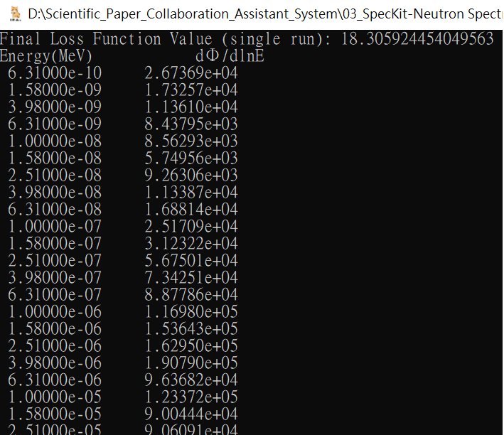
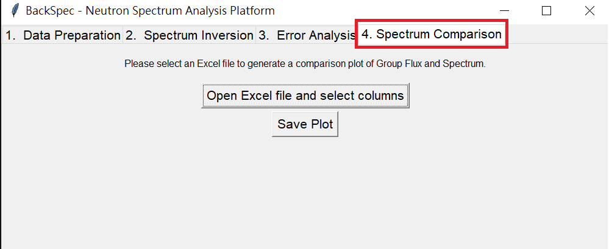
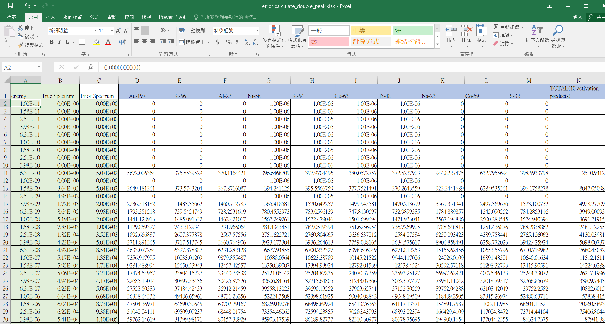
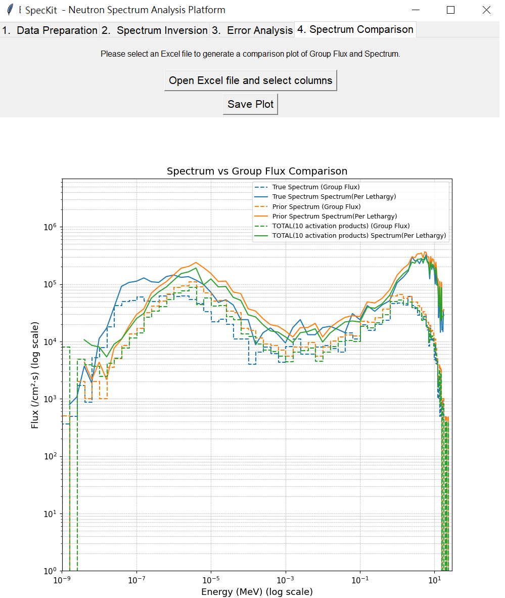
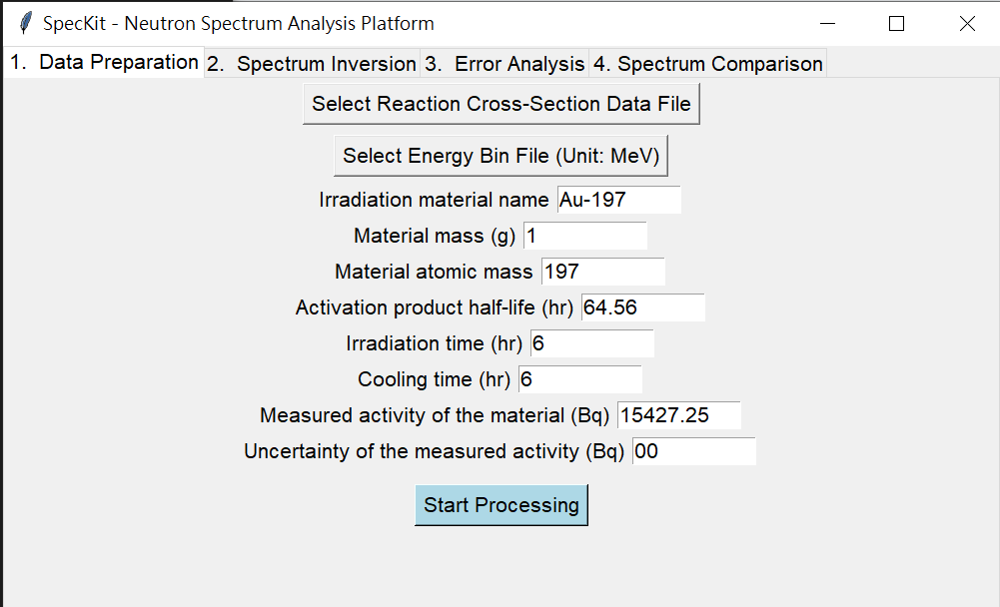
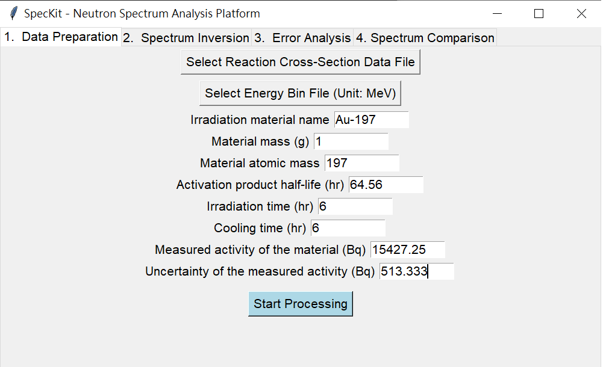
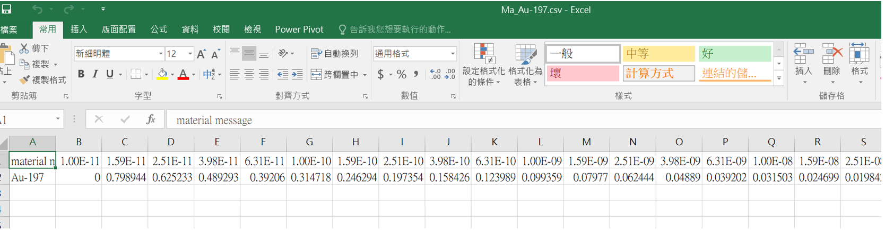
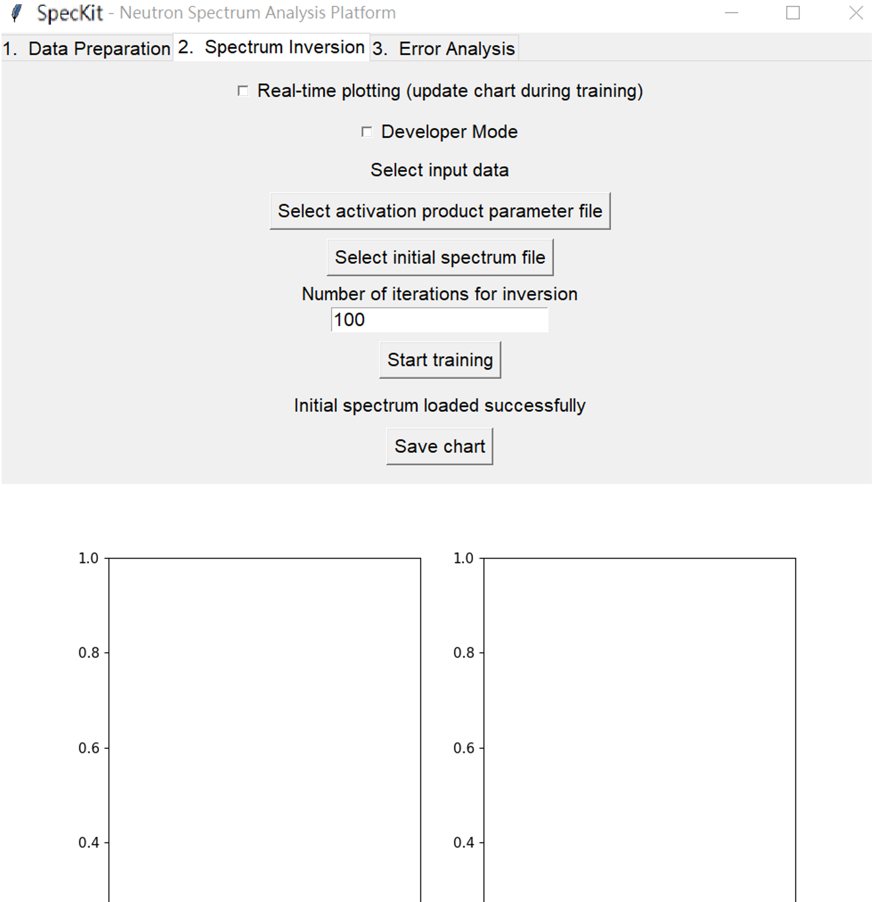
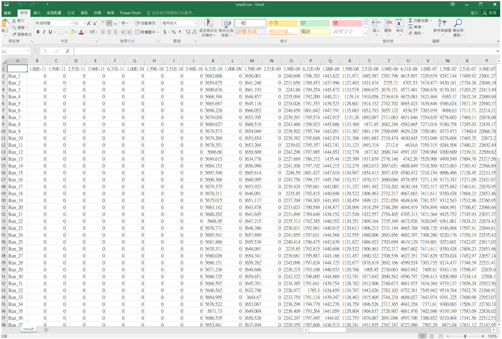
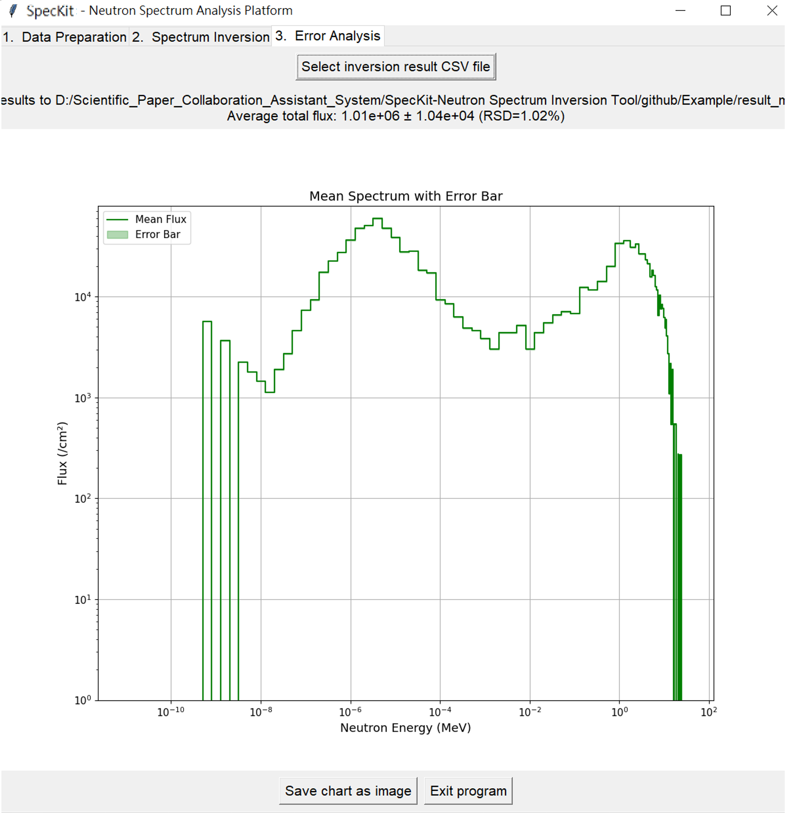

# SpecKit


*SpecKit: An Integrated Toolkit for Neutron Spectrum Unfolding Using Activation Reactions*

---

## 📖 Introduction
**SpecKit** is an open-source software toolkit designed for **neutron spectrum unfolding using activation reactions**.  
It integrates **reaction matrix preparation, spectrum inversion, uncertainty analysis, and visualization** into a single platform, supporting both **GUI operations and standardized CSV I/O**, making it suitable for research and educational applications.  

Compared with classical unfolding codes (e.g., SAND-II, MAXED, GRAVEL), SpecKit highlights:  
- Built-in **log-smoothness regularization** to stabilize the solution  
- **GUI interface and standardized CSV I/O** to reduce the learning curve  
- **Minimal dataset with one-click reproducibility** to ensure cross-platform reproducibility  
- **Uncertainty quantification embedded in the workflow**, eliminating the need for separate post-processing  

The core algorithm is based on:  
- Least-squares residual minimization  
- Log-smoothness regularization  
- Gradient descent optimization  
- Multiple fittings and Monte Carlo sampling for uncertainty estimation  

> SpecKit is not intended to replace classical codes, but rather to provide a **modern complement**: integrating unfolding and uncertainty quantification into a reproducible and user-friendly workflow for both research and teaching.

---
## 📦 Dependencies

- Python >= 3.8  
- numpy  
- matplotlib  
- pandas  
- scipy  
- tkinter (pre-installed in most Python distributions)  

---

## 📦 Installation
```bash
# Clone the repository
git clone https://github.com/lifangchen2021/SpecKit.git
cd speckit

```

---
## 📂 Repository Structure
```
SpecKit/
├── benchmark/                     # Performance verification cases
│    ├── double_peak/              # Double-peak spectrum case
│    │    ├── mcnp_input/          # MCNP input files
│    │    └── results/             # Unfolding results (CSV, figures, tables)
│    └── quasi_single_peak/        # Quasi-single-peak spectrum case
│         ├── mcnp_input/          # MCNP input files
│         └── results/             # Unfolding results (CSV, figures, tables)
├── cross_section/                 # Cross-section datasets (ENDF/B, IRDF formatted files)
├── fig/                           # Figures (example plots, documentation images)
├── src/                           # Source code (core Python scripts)
│    ├── cross_section_input_generator.py
│    ├── neutron_spectrum_solver.py
│    ├── spectrum_errorbar_viewer.py
│    ├── spectrum_groupflux_comparison.py
│    └── SpecKit.py
├── Example/                           
│    ├── Au-197_Au-198.txt
│    └──  prior.txt
├── .gitignore                     # Git ignore rules
├── LICENSE                        # License file (MIT)
└── README.md                      # Project description and usage guide

```
---

## 🚀 Usage
### Activation Material Selection and ASTM Standards

To perform neutron spectrum unfolding simulations and experimental analysis, this study employs a set of commonly used neutron activation materials, covering reactions from the thermal to fast neutron energy range. For each material, the primary activation reaction, resulting isotope and half-life, nuclear data source, and ASTM standard reference are summarized in **Table 1**.  

The selected reactions include (n,γ), (n,p), and (n,α), with materials chosen based on accessibility, stability, and compliance with international ASTM standards such as **E720**, **E264**, and **E263**. Reaction cross-section data are mainly referenced from **ENDF/B-VIII.0**, **ENDF/B-VI**, and **IRDF-2002G**.  

The chosen set of materials spans:  
- **Thermal neutron region** (e.g., Au-197, Na-23, Co-59): high cross-sections and sensitivity  
- **Fast neutron region** (e.g., Ni-58, Fe-56, Ti-48): suitable for capturing spectral peaks and tail variations  

By combining these materials, a comprehensive response matrix sensitive to a wide energy-group structure is constructed, forming the basis for unfolding input and error-sensitivity evaluation.  

### Table 1. Activation Materials and ASTM Standards

| Material | Reaction | Product | Half-life (h) | Data Library    | ASTM Standard |
|----------|----------|---------|---------------|----------------|---------------|
| Au-197   | (n,γ)    | Au-198  | 64.56         | ENDF/B-VIII.1  | E720-16       |
| Fe-56    | (n,p)    | Mn-56   | 2.57878       | ENDF/B-VIII.0  | E720-16       |
| Al-27    | (n,α)    | Na-24   | 15            | IRDF-2002G     | E266-92       |
| Ni-58    | (n,p)    | Co-58   | 1700.4        | ENDF/B-VI      | E264-19       |
| Fe-54    | (n,p)    | Mn-54   | 7492.56       | ENDF/B-VIII.1  | E263-18       |
| Cu-63    | (n,α)    | Co-60   | 46174.836     | ENDF/B-VI      | E523-92       |
| Ti-48    | (n,p)    | Sc-48   | 2011.44       | EAF-2010       | E526-92       |
| Na-23    | (n,γ)    | Na-24   | 14.4958       | ENDF/B-VIII.1  | E720-16       |
| Co-59    | (n,γ)    | Co-60   | 33524.196     | ENDF/B-VIII.1  | E720-16       |
| S-32     | (n,p)    | P-32    | 342.816       | ENDF/B-VIII.1  | E720-16       |


---
## 🧩 Module 1: Data Preparation
**Script:** `cross_section_input_generator.py`
**User Interface**  


This module prepares the **reaction cross-section data** and **energy group structure** before spectrum unfolding.

### Features
- Imports activation reaction cross-section libraries  
  (pre-packaged datasets are provided, from IAEA Nuclear Data Services: https://www-nds.iaea.org/exfor/endf.htm)
  
- Reads user-defined **energy group boundary file** (e.g., in MeV, converted to eV)
    
- Combines physical parameters of activation materials  
  (mass, atomic weight, half-life, irradiation time, cooling time, measured activity ± error)  
- Produces a standardized **CSV file** containing coefficients and activity data for unfolding
    

### Input
1. Cross-section data file (formatted from ENDF/B, IRDF, etc.)  
   - The first 8 lines contain metadata (library version, isotope, reaction type, etc.)  
   - Numerical cross-section values are read **starting from line 9**  
2. Energy group boundary file (defines group structure and prior spectrum)
   - The first line is header information  
   - Group boundary data are read **starting from line 2**

### Processing
- Interpolates/averages cross-section values over energy groups  
- Applies decay constants and calculates coefficients independent of flux  
- Supports writing multiple activation reactions into the same CSV file,  
  enabling **multi-material spectrum unfolding** in the inversion step  

### Output
- A CSV file with:
  - Group-wise coefficients  
  - Measured activities and associated uncertainties  
- Serves as the input matrix for the **Spectrum Inversion** module
---
## 🧩 Module 2: Spectrum Inversion
**Script:** `neutron_spectrum_solver.py`
  

This module performs the **core spectrum unfolding algorithm**.  
It takes the prepared reaction matrix (A) and activity vector (b) from the Data Preparation step,  
and reconstructs the unknown neutron spectrum (x).

### Method
- Based on **least-squares minimization**  
- Uses **gradient descent optimization** with **log-smoothness regularization** to stabilize the solution  
- Default convergence threshold is automatically calculated using the **chi-square distribution** (95% confidence level), ensuring statistical interpretability  

### Features
- **Developer Mode**: adjust learning rate, max iterations, and loss threshold  
- **Real-time plotting**: visualize loss convergence and spectrum reconstruction  
- **Multiple runs**: supports Monte Carlo perturbations of activity data (b ± σ) to analyze uncertainty  

### Output
- CSV file of reconstructed neutron spectrum (per run)  
- Convergence curves and spectrum plots (exportable as PNG/PDF)  
  
- The corresponding values are displayed in the program console.      

---
## 🧩 Module 3: Spectrum Error Bar Viewer
**Script:** `spectrum_errorbar_viewer.py`

This module processes the results from multiple spectrum inversion runs and generates statistical summaries with error bars.

### Features
- Loads multiple inversion results (CSV)  
- Calculates **mean flux** and **standard deviation** for each energy group  
- Computes **total flux**, its standard deviation, and relative standard deviation (RSD)  
- Visualizes results as error-band plots (Mean ± Std Dev) on log–log scale  

### Input
- CSV files from multiple spectrum inversion runs  

### Output
- CSV file containing group-wise mean flux and standard deviation  
- Error-band plot (Mean ± Std Dev), exportable as an image  
---
## 🎉 Bonus Feature: `spectrum_groupflux_comparison`

In addition to the main SpecKit modules (Data Preparation, Spectrum Inversion, and Error Analysis),  
we also provide an **extra visualization tool**:  

### 🔎 Purpose
`spectrum_groupflux_comparison` allows users to **simultaneously visualize**:
- **Group Flux** (step plot, dashed line)  
- **Spectrum (per lethargy)** (solid line)  

This makes it straightforward to compare group-wise neutron flux values with their corresponding spectrum representation, which is often requested by reviewers and useful for publication-quality figures.

### 🖼️ Example Usage
1. Select an Excel file containing energy groups and flux data. (an example file can be found at benchmark/double_peak/results/error calculate.xlsx)
    
2. Choose one or more columns to plot.  
3. The tool will generate a **comparison plot** where:  
   - Group flux is shown as a **dashed step curve**.  
   - Spectrum is shown as a **solid curve**.  
   - Multiple datasets can be overlaid automatically with distinct colors.  


### ✨ Features
- Automatic handling of zero/invalid flux values.  
- Log–log scale plotting (1E−9 MeV to 30 MeV).  
- High-resolution output suitable for journal figures.  
- Multi-line support with automatic color cycling.  

---

📌 *Note:* This feature is provided as a supplementary visualization tool.  
It is not part of the core SpecKit methodology, but serves as a convenient way to illustrate results for papers, reports, or teaching purposes.

---

## Benchmarks — MCNP
To evaluate the performance of SpecKit, MCNP simulations were employed to generate both synthetic and a priori neutron spectra. The neutron spectrum was discretized into 120 energy groups, and ten activation products were selected as response monitors for the spectral unfolding analysis.
### (1) Double-Peak Spectrum

For the performance verification study, the **true spectrum** was generated using the MCNP code.  
The setup simulates a proton beam impinging on a beryllium target (p + Be), followed by a 10 cm water layer and a 5 cm concrete layer.  
The neutron spectrum was tallied on a spherical surface with a 100 cm radius centered on the target (F2 tally).  

A corresponding **prior spectrum** was also constructed with a similar shape but different moderation conditions.  
In this case, only a 10 cm water layer was placed outside the Be target (no concrete), while the tally location remained the same.  
This spectrum was used as the prior input for sensitivity testing of the unfolding algorithm.  

**Figure 8** shows the MCNP geometry models for the true and prior spectra.  
- Pink: Be target  
- Blue: water  
- Yellow: concrete  
- White: vacuum  

**Figure 9** compares the true spectrum and prior spectrum.  
Due to the additional concrete layer in the true spectrum case, neutron energies were further moderated,  
resulting in a clear shift toward the lower energy region.

### (2) Quasi-Single-Peak Spectrum

For the error-sensitivity analysis of spectrum unfolding, the **true spectrum** was generated using the MCNP code by simulating neutrons produced from a proton beam impinging on a beryllium target (p + Be).  
A corresponding **prior spectrum** with a similar spectral shape was also constructed as the initial input condition for unfolding tests.  

The difference between the prior and true spectra mainly arises from two sources:  
1. **Proton beam current setting** — The prior spectrum assumes twice the proton beam current compared with the true spectrum, resulting in higher flux at the main energy peak and across the medium-to-high energy region.  
2. **Geometrical/material differences** — In the prior spectrum model, an additional 0.6 cm water layer was placed in front of the measurement position, and the 0.2 cm surface concrete layer (present in the true spectrum) was removed, eliminating part of the neutron moderation and scattering effect.  

The neutron flux was tallied using an F4 tally within a thin spherical shell (radius 15.0–15.5 cm) centered at the Be target.  

**Figure 10** illustrates the MCNP geometry setup for the true and prior spectra.  
- Red: Be target  
- Blue: water  
- Yellow: air  
- Green: concrete  

**Figure 11** shows the comparison between the true and prior spectra.  
Because both material differences and neutron yield variations are present, the flux differences between energy groups become more pronounced compared with the double-peak case.
---
## Benchmark -- Error Analysis

### (1) Double-Peak Spectrum

The error analysis was carried out by comparing the **activation reaction data** generated from the true spectrum with the unfolding results obtained using the **prior spectrum** as the initial input. The objective was to evaluate the sensitivity and accuracy of the unfolding algorithm across different neutron energy ranges.  

Table 2 summarizes the relative error of the unfolded spectra, defined as  
**ABS(calculate − true) / true**,  
for three representative energy intervals:  
- Thermal region: 1×10⁻¹¹ – 2.5×10⁻⁸ MeV  
- Epithermal/Intermediate region: 2.5×10⁻⁸ – 1 MeV  
- Fast region: 1 – 30 MeV  

In this study, we tested several alternative group boundary configurations to evaluate the performance of the unfolding procedure. We found that setting the upper limit of the thermal region at 0.0258 eV provides a clearer separation of activation product sensitivities across energy ranges, which in turn highlights the performance of SpecKit in reconstructing neutron fluxes.

This choice is intended solely for illustrative and benchmarking purposes, and should not be interpreted as a new standard definition of thermal, epithermal, or fast neutron ranges.

A total of **ten activation products** were selected as reaction channels in this benchmark:  
Au-197, Fe-56, Al-27, Ni-58, Fe-54, Cu-63, Ti-48, Na-23, Co-59, and S-32.  
The relative error for each activation product was evaluated individually in the three energy regions and compared with the prior spectrum. In Table 2,  
- **Blue shading** indicates that the unfolded spectrum error is smaller than that of the prior spectrum.  
- **Red shading** indicates a larger error compared to the prior spectrum.  

Results show that **Au-197, Na-23, and Co-59** provide better reconstruction in the thermal region (E < 2.5×10⁻⁸ MeV), while most other products perform better in the fast neutron region (E > 1 MeV). When all ten activation products are included simultaneously in the iterative calculation, the reconstruction accuracy is significantly improved across the full spectrum. The **total relative error** in all three energy ranges is lower than that of the prior spectrum.  

This observation is consistent with theoretical expectations: the combination of multiple reaction channels compensates for the limited sensitivity of individual reactions in specific energy regions, thereby enhancing both the **stability** and **accuracy** of the spectrum unfolding process.  

**Table 2.** Relative error of unfolded spectra in different energy regions  
Error metric: ABS(calculate − true) / true  


**Figure 12** shows the comparison between the true spectrum and the unfolded spectrum. In the double-peak spectrum case, the use of all ten activation products (TOTAL) clearly outperforms individual reconstructions. The overall curve reproduces the peak positions and relative intensities much more accurately, with deviations in the medium-to-high energy range significantly reduced. Although some local discrepancies remain at the low-energy end due to cross-section sensitivity limitations, the combined multi-reaction approach effectively suppresses systematic deviations and improves both **accuracy** and **robustness** across the entire energy range.


---
### (2) Quasi-Single-Peak Spectrum  

The error test was performed by comparing the **activation reaction data** generated from the simulated spectrum (**True Spectrum**) with that from the **Prior Spectrum**, in order to evaluate the **sensitivity and accuracy** of the unfolding algorithm in different energy regions.  

Table 3 summarizes the relative error of the unfolded spectra, defined as:  

**ABS(calculate − true) / true**,  

for ten activation products across three representative energy intervals:  
- Thermal region: 1×10⁻¹¹ – 2.5×10⁻⁸ MeV  
- Epithermal/Intermediate region: 2.5×10⁻⁸ – 1 MeV  
- Fast region: 1 – 30 MeV  

Key differences between the **Prior Spectrum** and the **True Spectrum** include:  
- **Proton beam current**: the prior spectrum assumes about twice the current compared to the true spectrum.  
- **Geometry setup**: the prior spectrum ignores structural effects such as the concrete layer, leading to deviations in neutron moderation.  

Table 3 further shows the unfolding errors for each activation product, both individually and in combined iteration.  
- **Blue shading** indicates smaller errors compared to the prior spectrum.  
- **Red shading** indicates larger errors compared to the prior spectrum.  

Results demonstrate that the unfolding code **SpecKit** can effectively correct prior-spectrum anomalies caused by proton current mismatch.  

In detail:  
- **Thermal region (1×10⁻¹¹–2.5×10⁻⁸ MeV):** Errors are significantly amplified (1.076–3.875×), mainly due to cross-section sensitivity.  
- **Intermediate region (2.5×10⁻⁸–1 MeV):** Errors converge within 0.056–0.548, showing improved stability.  
- **Fast region (1–30 MeV):** Errors are the lowest (<0.014 for most), except **Au-197** and **Co-59**, which remain higher due to (n,γ) cross-section effects across energy scales.  

Notably, **multi-material combinations** effectively suppress extreme errors in the thermal region and stabilize reconstruction in the intermediate and fast regions.  

---

#### Table 3. Relative Error of Unfolded Spectrum by Energy Region  


---

**Figure 13.** Comparison of the unfolded spectra with the true simulated spectrum.  
The unfolded results match closely above 1 MeV, while deviations rapidly increase toward lower energy ranges.  

---

We employed **ERRE** as the evaluation metric to compare **SpecKit** with classical neutron spectrum unfolding programs, including **SAND-II**, **STAY’SL**, and **RFSP-JÜL**.  

SpecKit achieved an **ERRE of ~5.8%**, which falls within the typical range reported for classical codes (**3–6%**). Although the validation spectra differ — previous studies generally involved smaller prior errors (~37%) — SpecKit was still able to converge to an ERRE of approximately 5.8%.  

This demonstrates performance **consistent with benchmark programs** and highlights the **robustness** of the SpecKit method.  


### 📊  Comparison of ERRE Performance Between SpecKit and Classical Unfolding Codes

| Software         | ERRE Range (Average Activity Error) | Spectrum Case           |
|------------------|--------------------------------------|--------------------------|
| **SAND-II**      | ~6.13% [18]                          | CFRM                     |
| **CRYSTAL-BALL** | ~6.55% [18]                          | CFRM                     |
| **RFSP-JÜL**     | ~6.74% [18]                          | CFRM                     |
| **SpecKit**      | ~5.8%                                | Test case in this study  |


**ERRE**： Zijp, W. L., & Nolthenius, H. J. (1979). *Comparison of neutron spectrum unfolding codes (Sixth progress report)* (ECN-79-008). Petten: Netherlands Energy Research Foundation (ECN), prepared under IAEA Research Contract 1811/R1/RS.

---
## 🔬 Example Workflow

This example demonstrates how to use **SpecKit** to calculate neutron flux at a measurement position using activation data (Au-197) and a simulated prior spectrum.

### Experimental Data

- **Activation Material**: Au-197  
- **Mass**: 1 g  
- **Atomic Weight**: 197  
- **Half-life**: 64.56 hours  
- **Irradiation Time**: 6 hours  
- **Cooling Time**: 6 hours  
- **Measured Activity**: 51,467.25 Bq  
- **Uncertainty (1σ)**: 514.333  

The simulated neutron flux file (`prior.txt`) was obtained using **MCNP**.

---

### Step 1: Data Preparation

1. Select **Cross-Section Data File**:  
Au-197_Au-198.txt

2. Select **Energy Bin File**:  
prior.txt


3. Enter the activation data and click **Start Processing**:
- (a) **Without error analysis** → set `Uncertainty of Measured Activity = 0`

- (b) **With error analysis** → set `Uncertainty of Measured Activity = 514.333`
  
4. Choose the save location and filename for the output file.  

---

### Step 2: Spectrum Inversion

1. Click **Select Activation Product Parameter File**, then choose the CSV file generated in Step 1.  
2. Select the initial spectrum file:  
prior.txt

3. Set **Number of Iterations for Inversion**:
- (a) Without error analysis → `1`  
- (b) With error analysis → desired number of iterations

4. Click **Start Training**, then select save location and filename:
- Without error analysis → only one dataset will be generated, and the computation ends.  
- With error analysis → multiple results are generated and must be processed in Step 3.

5. Click **Save Chart** to export the plot.  

---

### Step 3: Error Analysis

1. Select the output file from Step 2.  
- The program will automatically compute the results and generate a CSV file with suffix:  
  ```
  _mean_std
  ```
- Example: `result_mean_std.csv`  
2. Optionally, click **Save Chart as Image** to export the results as a figure.  

---

👉 With these steps, you can reproduce the neutron flux calculation based on Au-197 activation and compare simulation with experimen


---
## 🔽 Download and Installation

A precompiled executable file (**SpecKit.exe**) is provided for users who prefer to run the program without compiling the source code.  

- Download the latest release from the [Releases page](../../releases).  
- Place the executable in any working directory.  
- Run `SpecKit.exe` directly (no installation required).  

> ⚠️ Note: The `.exe` file is built for **Windows (64-bit)**.  
For other platforms, please use the Python source code provided in this repository.  

---
## 📝 License
This project is licensed under the MIT License - see the [LICENSE](LICENSE) file for details.

---

## 🧑‍💻 Contributing
Contributions are welcome! Feel free to open issues, submit pull requests, or suggest new features. 

---
